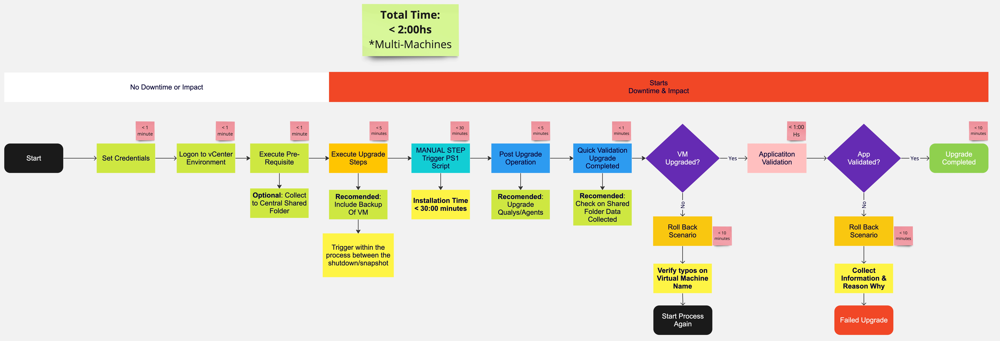

# Kyndryl Scripts - Windows Upgrade from 2016 to 2019
This Repo contains powershell scripts to upgrade windows server 2016 to 2019 in Kyndryl Environment.

### Approach:
Utilizes default mechanism that allows reduction of downtime and effort from all the virtualization & Automation team.

### Standards Tools
Utilizing default tools, allow easy comprehension from the tecnical teams and avoid extra costs of tooling

Current tools utilized are:
- Powershell (Default Scripts)
- PowerCLI (Manager vCenter & VMs)
- RSAT (Manage AD objects via PS module)

### Order of Execution
According to the following diagram, the exection of scripts are to run on this specific order & *NOT in parallel.

Note: It can run in parallel if virtual machines are not the same. Trying to Upgrade and Roll back at same time, not a good strategy.

>NO Downtime nor Impact.

1- Set you Credentials #Guarantee you have enough priviledges for the tasks
2- Logon to vCenter via PowerCLI
3- Execute Pre-Requisite scripts ( No downtime or impact)

> Downtime & Impact = Requires change window.

4- Execute Upgrade Scripts
5- > MANUAL TASK: Execute the Powershell Script on 
>>c:\\upgrade\\upgrade_this_machine.ps1

 Wait for upgrade completion : ~ 0:30minutes 

6- Execute Post Upgrade Operation
7- Check files for validation of OS upgraded
8- VM Upgrade -> Yes/No
9- Starts with Application Validation
10- Application Validated -> Yes/No

Upgrade Completed || Roll Back Completed

### Workflow Diagram

